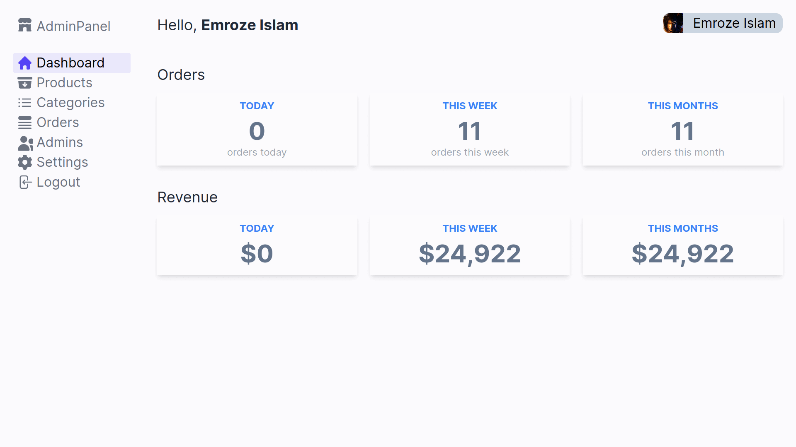
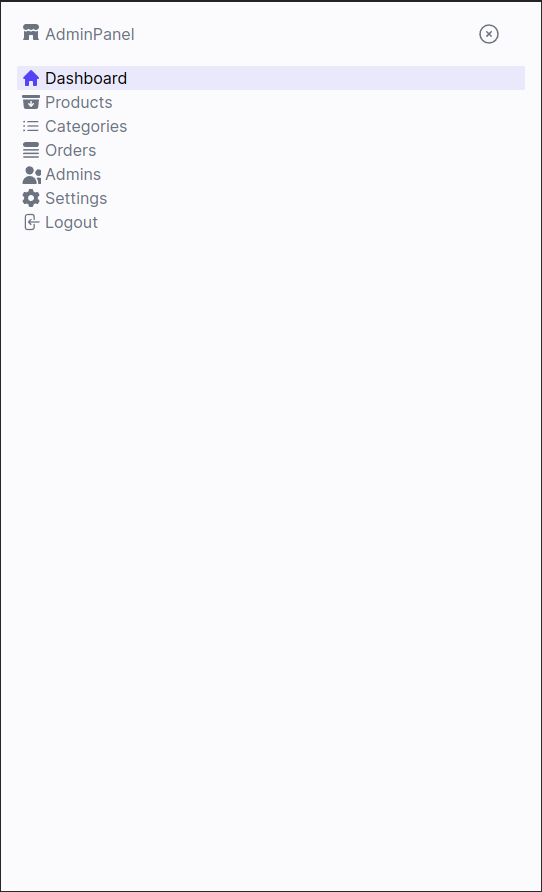

## Technology Used

* Next.js 13
* TailwindCSS
* NextAuth
* Amazon S3
* MongoDB

## Live Website

Link: https://ecommerce-admin-next-js.vercel.app/

## How the website looks

|   Desktop Mode<br />   |
| :-------------------------------------------------------------------: |
| In smaller device<br /> |

This is a [Next.js](https://nextjs.org/) project bootstrapped with [`create-next-app`](https://github.com/vercel/next.js/tree/canary/packages/create-next-app).

## Getting Started

First, install using

```
yarn install
```

then run the development server:

```bash
npm run dev
# or
yarn dev
# or
pnpm dev
```

Open [http://localhost:3000](http://localhost:3000) with your browser to see the result.
